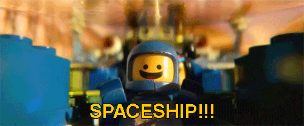

:::info TL;DR #1

Regolith will no longer use AI-generated images due to ethical, environmental, and moral concerns about the technology.

:::

:::warning TL;DR #2

If you haven't read Matthew Inman (of The Oatmeal)'s [A cartoonist's review of AI art](https://theoatmeal.com/comics/ai_art) go and read that. He says everything better than I ever could and what follows is just a poorer, less creative version of that.

:::

You may have noticed that [Regolith.rocks](https://regolith.rocks) is a bit simpler nowadays. As of this moment I've made the decision to remove any AI-generated images from the site and commit to this policy going forward. The "art" in question was mainly the sci-fi background images you used to see behind every section of the website. In its place I've got some easy CSS trickery I intend to gradually improve over time.

## *"Ok, but why? And why now?"*

Let's start with a fact about me that I'm basically [Benny the spaceman](https://youtu.be/LhG8Ry-L3IQ) from the Lego Movie. As a kid if you placed me in a chair with crayons and a diner placemat or concert program what you'd get in return is A) hours of silence any parent would envy and B) an unending, bottomless cascade of pictures of spaceships.

 The word "obsession" almost feels quaint. Then again if you back [Star Citizen](https://www.youtube.com/watch?v=CDf0-rt7tX0) then you probably relate. In my mind I was [Ralph McQuarrie](https://en.wikipedia.org/wiki/Ralph_McQuarrie) and my drawings were the wild escapades of adventurers at the edges of explorable space, the product of a well-fed imagination. Even today, when I see sci-fi concept art, that inner child wakes up with a squeal of joy and does a little chicken dance in my brain.
 
 When Midjourney AI launched, I suddenly found I could type my thoughts into a box and get back "art" that looked to me like a [Syd Mead's](https://en.wikipedia.org/wiki/Syd_Mead) original. I didn't ask questions; I just started creating. This thing was manifesting my imagination and the seduction of that immediately silenced every other voice.

Now we're a few years into this and the dialog around the tools has grown to a thunderous roar. I heard and agreed with all the arguments around stolen art for training, compensating artists fairly, eco-effects etc. but I thought "this is just a stupid little hobby project. I'm not really hurting anyone". (*Note: Oof. Typing that last sentence and then seeing it written down was tough.*) 

But now we've come to the breaking point. Last week google released their new NanoBanana product so I eagerly logged on. A few prompts later I had this:

<blockquote class="bluesky-embed" data-bluesky-uri="at://did:plc:4d74derbqgsplpwk2qqr567x/app.bsky.feed.post/3ma2xh3ngsc2y" data-bluesky-cid="bafyreiaccmdue5bluxqmhnvrlrh7tz6st4ixmvyuxocwpul4zd7ztebrwe" data-bluesky-embed-color-mode="system">
Nano Banana is pretty rad for making desktop backgrounds. #StarCitizen #SpaceMining #AIArt  <a href="https://bsky.app/profile/did:plc:4d74derbqgsplpwk2qqr567x/post/3ma2xh3ngsc2y?ref_src=embed">[image or embed]</a>
&mdash; Regolith Co. (<a href="https://bsky.app/profile/did:plc:4d74derbqgsplpwk2qqr567x?ref_src=embed">@regolith.rocks</a>) <a href="https://bsky.app/profile/did:plc:4d74derbqgsplpwk2qqr567x/post/3ma2xh3ngsc2y?ref_src=embed">December 15, 2025 at 5:07 PM</a></blockquote>

I mean, YEAH RIGHT?!?! YEAH!!! Talk about understanding the assignment. That's a freaking ARGO Mole coming in for a landing. This isn't just slop; not exactly. I wouldn't've hired an artist to do this. This was just me having fun right? RIGHT?!? I gleefully posted the new pics on Bluesky and went to bed.

The next day there were comments. It wasn't a backlash, not really. I didn't anger the internet beast or get cancelled or anything like that. Most of it was just reasonable people asking me why I felt the need to use AI. The subtext was disappointment. This was all it took to finally make me take a hard look at AI images, especially how it pertains to hobby projects. I won't keep you in suspense; here's what I've decided:

## Nope!

5 reasons why:

1. AI is trained unethically. It didn't have to be but it was. No getting around that.
2. A fleshy, squishy human should make and be compensated fairly for every piece of art.
3. AI is developed, controlled and entirely funded by people I wouldn't trust with a pack of matches let alone the fate of the world.
4. The ecological impact of AI datacenters cannot be justified.
5. It just feels gross.

Let's go point-by-point:

### 1. AI is trained unethically

This is really simple: AI is trained on stolen art. The artists did not consent to their work being sucked up into these models. I don't need to explain any more. [Better writers than me have already](https://www.publishersweekly.com/pw/by-topic/digital/conferences/article/97528-unethical-ai-training-harms-creators-and-society-argues-ai-pioneer.html).

It didn't have to be this way. It could have been trained solely on public domain art. They could have compensated artists for their work. They could have an opt-in system. Could. Could. Could. Didn't.

### 2. Hire a human

This is where things get a bit sticky. I know artists; I like artists; I want artists to be compensated for their work. 

But here's the thing: I would never have paid an artist to do those backgrounds because the budget for art is $0. I *could* have done them myself but I chose to spend those precious hours of free time on the app instead of the backgrounds. 

There's more to say on this thought so bear with me as we discuss it more below.

### 3. AI was Built, Controlled and Funded by Bad People.

It is staggering how quickly the shitty dystopian fiction of 2015 became the mundane reality of 2025. We have handed tools capable of reshaping—or erasing—humanity to the very people least likely to possess empathy. What a time to be alive.

Even if AI is just a dribbling infant that will never go all "Skynet" and reduce the earth to a cinder there's still growing suspicions that the existential risk of AI in its currect state is a marketing ploy. It could be a myth manufactured by insane tech titans to regulate away competitors and inflate stock prices by feigning a god-like power they haven't actually built. If true, that level of great-and-powerful-oz malaevolent cynicism should make us all pause and we all need to take 10 steps back from this ledge immediately.

### 4. The environment

It turns out that AI is basically an environmental catastrophe. We are currently trading the energy and water supplies of entire cities so people can make pictures of Gandalf wakeboarding. As a counterpoint: breathing and drinking water are pretty neat things to do!

While it is possible that AI technically has the potential to "solve fusion" and bring us the infinite energy that would power this new world, the AI to do that is not the same AI that makes [Will Smith eat spaghetti](https://www.youtube.com/watch?v=vbWe5k4fFWE). ChatGPT will never wake up and make a Tokamak reactor work. The AI that *might* eventually do this will be hyper-specialized, written by scientists and have exactly 0% chance of calling itself "mecha-hitler".

Also, predictably, the [environmental impacts](https://news.mit.edu/2025/explained-generative-ai-environmental-impact-0117) of all of this will hit vulnerable people first in the form of increased energy prices, water availability and quality problems, decimation of small communities, noise pollution etc.

Many of you probably don't know this but in my real life I work in a field that is heavily affected by climate change. Burning the rainforest so I can make pretty pictures is just not something I can justify... well, starting now I guess.

### 5. *It* feels gross so now *I* feel gross

Given how much AI slop there is now and how the dead internet theory I've found there's a growing distaste for AI art, even when it's not strictly slop. What's worse is the delta between the joy of the thing itself followed by the disappointment when you discover how it was made makes me feel even worse. It's like a windchill effect for visual media.

I think, for me anyway, the reason for this comes back to what [Matthew Inman said on his piece](https://theoatmeal.com/comics/ai_art). Art, even background art, is a conversation between humans and requires struggle and effort. Anything else just feels hollow and uncanny. It's a little pretentious but he's not wrong.

## Hobby Projects are different...right?!?

I feel like the hobbyest angle of generative AI hasn't gotten quite enough discussion so that's where I can add a little bit of value.

When a big company replaces its graphic designers, developers and office workers with AI agents so that CEOs can have stock buybacks and bigger bonuses that's a cartoonishly clear, unambiguous evil. But what about the hobbyist who can use AI to make more things more better for more people?

Let's be really clear: [Regolith.rocks](https://regolith.rocks) is a hobby project. Nearly every line of HTML, JS, CSS etc. was written by my over-caffeinated fingers after work, on weekends or on holiday. Every expense is out of pocket. [Kofi Donations](https://ko-fi.com/regolithco) have been a great help and have covered the server costs... but only barely. A few people have volunteered their time to help (and I am grateful) but just about 99% of everything is my fingers tippity tapping out code late into the night. There's the context. 

I *want* to have good art but there is no budget for me to compensate anyone fairly to do it and doing it myself would rob from features and bug fixes.

If I wasn't going to hire an artist and I was only going to do it myself, aren't I only robbing myself? Then, a new, apparently low-cost tool arrives on the scene with a big friendly button that says "Make it better" and I think "where exactly is the harm?". Every freaking-where as it turns out. 

Many of us are being tested now and finding our reasons to push that button, or not. For me it wasn't laziness but the realization that every hour I save is another feature I can implement or another bug I can fix on Regolith. Also it made my inner child happy.

"If you can't afford to buy it fairly you just shouldn't have it" is a great and virtuous stance but in practice it's more of a compromise by inches. What if I just use MidJourney to get ideas about framing, lighting and composition of my images then do the rest myself? What if I just scan through other people's NanoBananas to get ideas? Maybe I'd be more willing to entertain these compromises if the other reasons listed above didn't exist. As it stands though it's a tsunami of arguments that destroys my little argument sandcastle.

## So where do we go from here?

Luckily most of Regolith is 100% free-range human, [made by meat](https://www.youtube.com/watch?v=T6JFTmQCFHg). The backgrounds are easy to drop so they're the first to go. The little banner images are gone too. I've got a few little icons and "share this" images and then that about does it. I'm not terrible at digital art so maybe I'll find some time and inspiration some day to make them again properly.

For those of you feeling judged or preached-at right now: If you're a creator and you're still using AI art I'm not going to call you out. Everyone should draw their own lines. The world is a fabulously complex and nuanced place. I submit this simply as part of the conversation and to sort out my own ideas on the subject.

If I missed anything or you have something to say on the subject feel free to reach out on Bluesky either at [@raychaser.regolith.rocks](https://bsky.app/profile/regolith.rocks/post/3matutfl4vk2i). I'm always curious what fellow hooman shadows are thinking about this stuff.

---

*p.s. There's a separate but related conversation we probably all need to have about AI coding tools but I'm way too tired for that right now.*

---

*p.p.s. This came out literally as I was writing this blog post so I'll just leave it here:*

<iframe width="560" height="315" src="https://www.youtube.com/embed/uiHEni0v5I0?si=_1m9WAd3QyZIt6gz" title="YouTube video player" frameborder="0" allow="accelerometer; autoplay; clipboard-write; encrypted-media; gyroscope; picture-in-picture; web-share" referrerpolicy="strict-origin-when-cross-origin" allowfullscreen></iframe>

---

## References and resources:

1. [A cartoonist's review of AI art](https://theoatmeal.com/comics/ai_art)
2. [Unethical AI Training Harms Creators and Society, Argues AI Pioneer](https://www.publishersweekly.com/pw/by-topic/digital/conferences/article/97528-unethical-ai-training-harms-creators-and-society-argues-ai-pioneer.html)
3. [Explained: Generative AI’s environmental impact](https://news.mit.edu/2025/explained-generative-ai-environmental-impact-0117)
4. [They're Made Out Of Meat](https://www.youtube.com/watch?v=T6JFTmQCFHg) 
-- Short story by Terry Bisson as a short film directed by Stephen O'Regan. Not completely relevant but it makes me laugh.
